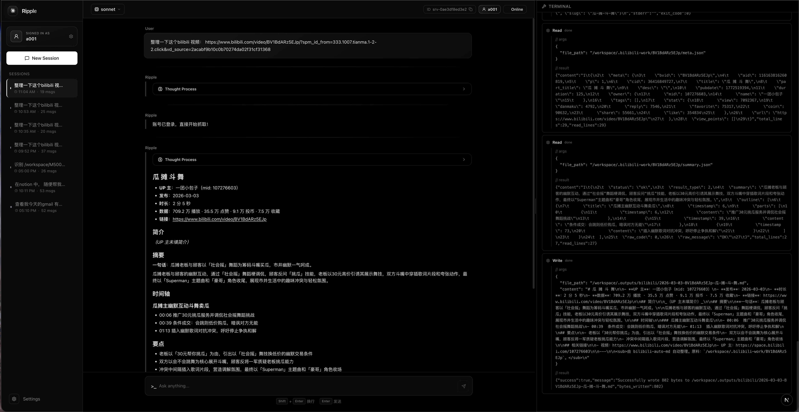

# Ripple 涟漪

*让每个提问都成为涟漪的中心，每一次迭代都是向着解的蔓延。*

**Ripple** 是一个受 [claude-code](https://docs.anthropic.com/en/docs/agents-and-tools/claude-code/overview) 启发而构建的 Python Agent 系统。

> ⚠️ **注意：本项目目前处于快速开发（WIP）阶段，核心机制随时可能调整，功能尚不稳定。**

---

## 预览

  

 

Built with ❤️ by echonoshy

