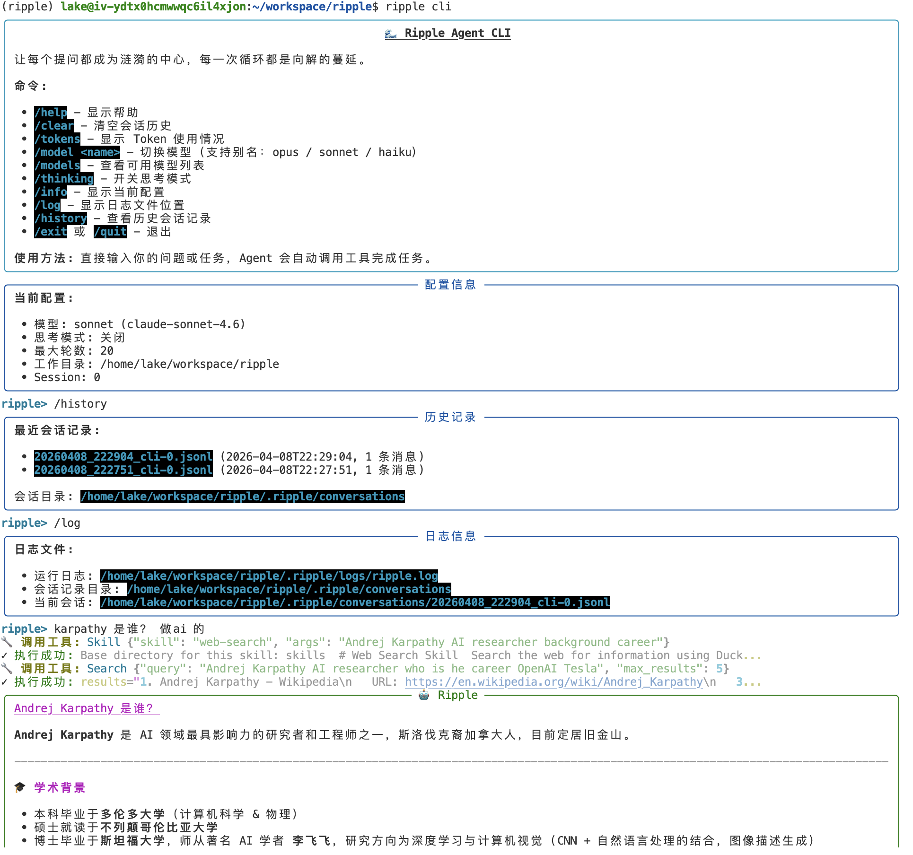
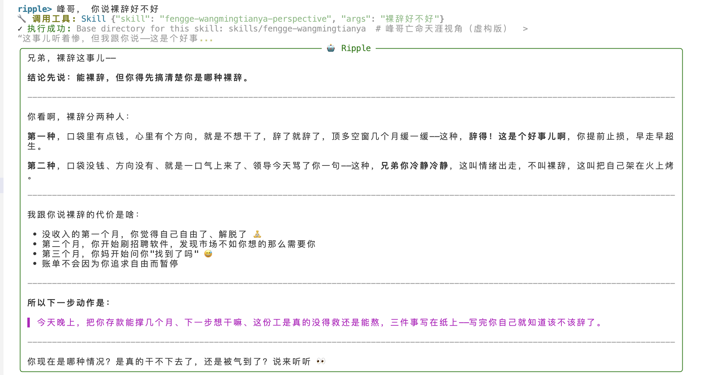

<div align="center">


# Ripple 涟漪

*让每个提问都成为涟漪的中心，每一次循环都是向解的蔓延。*

[](https://www.python.org/)
[](https://opensource.org/licenses/MIT)
[](https://github.com/echonoshy/ripple)

**Ripple** 是一个基于 Python 的 Agent 系统，灵感源自 [claude-code](https://docs.anthropic.com/en/docs/agents-and-tools/claude-code/overview)。

完整的 Agentic Loop · 强大的工具调用 · 灵活的 Skill 系统

</div>

---

## ✨ 核心特性

- 🔄 **Agent Loop** — 多轮对话、自动工具调用、智能任务完成
- 🛠️ **工具系统** — Bash、Read、Write、Search、SubAgent 等内置能力
- 📚 **Skill 系统** — Markdown + YAML 定义专属技能，支持动态加载与覆盖
- 🤖 **SubAgent** — Fork 机制处理复杂多步任务
- 🔌 **多模型支持** — 通过 OpenRouter 接入 Claude Opus / Sonnet / Haiku

## 📸 演示

<p align="center">
  
</p>

<p align="center">
  
</p>

## 🚀 快速开始

```bash
# 克隆仓库
git clone https://github.com/echonoshy/ripple.git
cd ripple

# 安装依赖
uv sync

# 配置 API Key (编辑 config/settings.yaml)
api:
  api_key: "your-api-key-here"
  base_url: "https://openrouter.ai/api/v1"

# 启动
uv run ripple cli
```

## 📚 文档

详细文档正在完善中，敬请期待...

- 使用指南
- Skill 开发
- 工具扩展
- API 参考

## 📄 开源协议

本项目基于 [MIT License](https://opensource.org/licenses/MIT) 开源。

---

<div align="center">
<sub>Built with ❤️ by echonoshy</sub>
</div>
