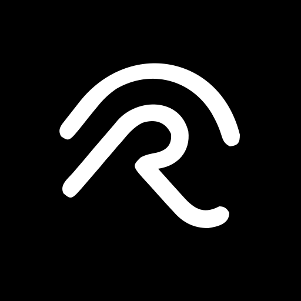
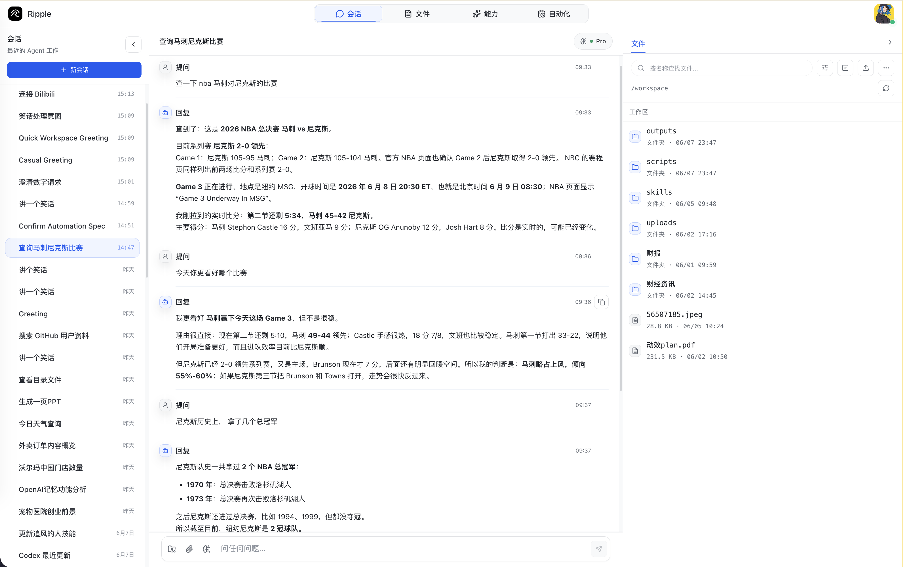
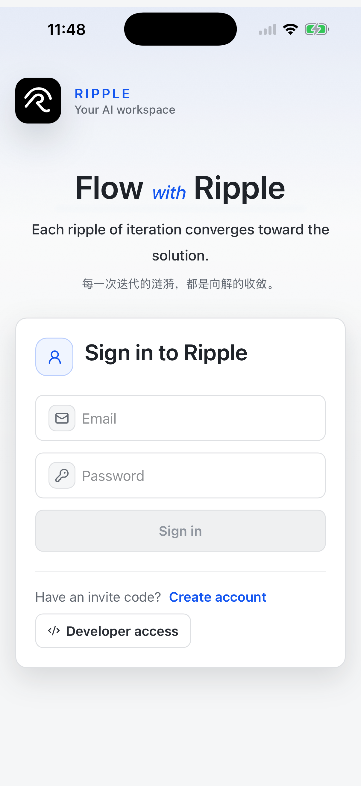
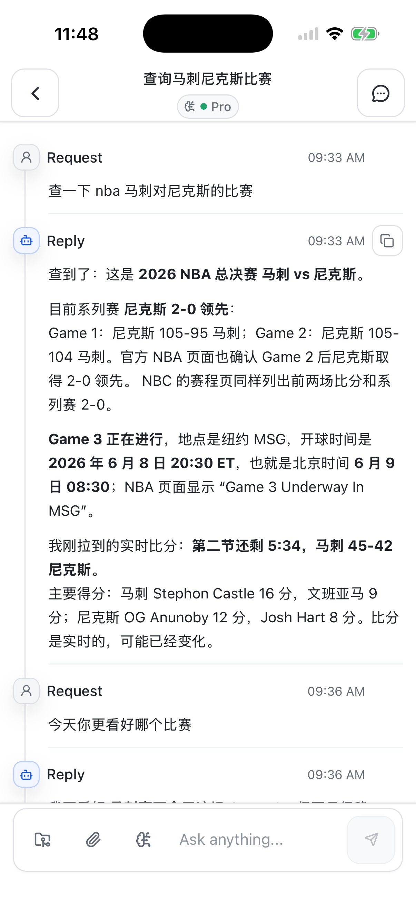
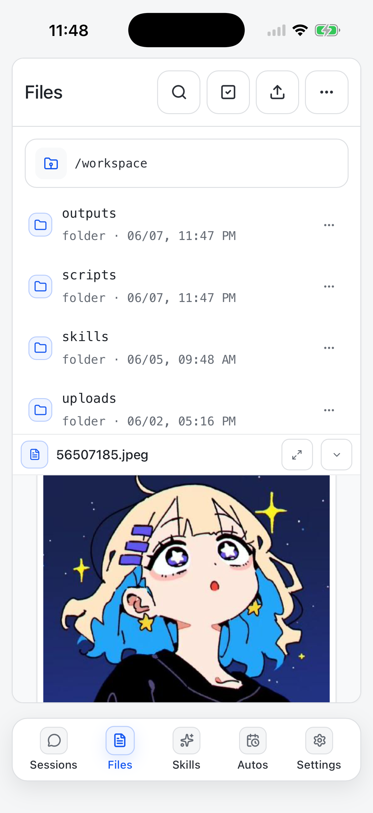
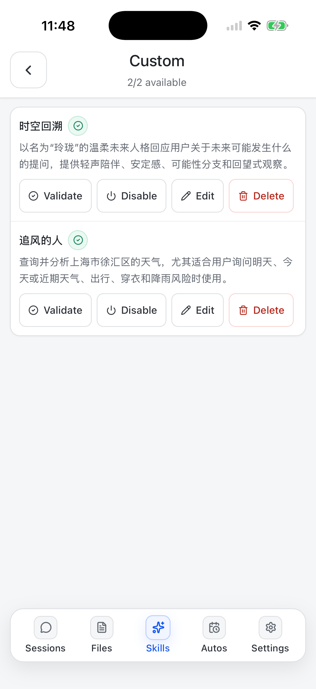
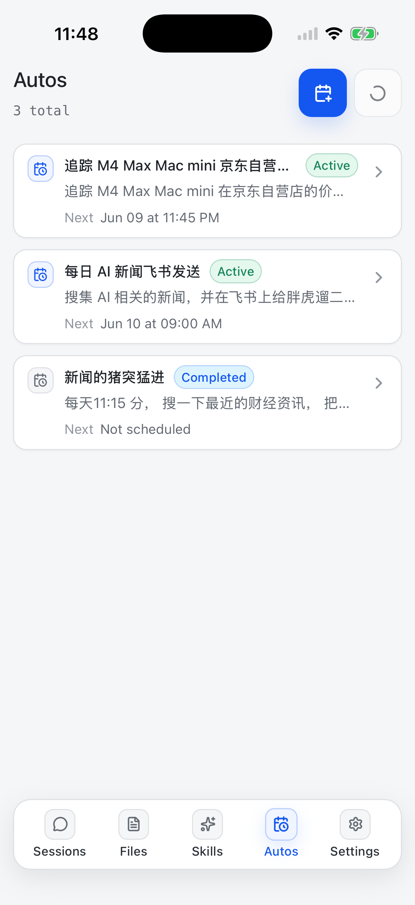

<div align="center">


# Flow with Ripple

> 每一次迭代的涟漪，都是向解的收敛。
> Each ripple of iteration converges toward the solution.

**面向真实终端用户的多端 AI Agent 工作空间**

[](crates/ripple-server)
[](app)
[](app)
[](app/src-tauri)

[展示站点 (Site)](https://echonoshy.github.io/ripple) · [构建与部署 (Build)](docs/BUILD_AND_DEPLOY.md) · [开发指南 (AGENTS)](AGENTS.md)

</div>

---

<div align="center">
  
</div>

<br />

<div align="center">
  
  
  
  
  
</div>

---

## 项目定位

**Ripple** 是一个面向 Web / Tauri / Mobile 多端客户端的 AI Agent 工作空间与控制面。它把会话、文件、能力、自动化、设置与用量管理放在同一个终端用户界面里，并把实际执行委托给服务端 Codex app-server。

随着大语言模型（LLM）生态的快速演进，Agent 的**纯执行层能力**（如 Claude Code / Codex 等）正逐渐收敛为底层的标准化基础设施（Infrastructure）。

在这一背景下，**用户专属数据、开箱即用的交互体验、持久化记忆与个性化 Skill**，才是真正需要构建差异化体验的关键赛道。Ripple 的定位是在保持控制面 / 执行面分离的同时，让每一次迭代都能更稳定地向解收敛。

### 产品能力

*   **会话工作流**：用户可以创建、恢复和继续长期 Agent 会话，历史消息、生成过程和上下文在同一 workspace 中持续存在。
*   **文件与产物**：内置 workspace 文件浏览、搜索、上传、预览和下载，支持查看 Agent 生成的文档、图片、PDF 与脚本产物。
*   **能力与连接器**：将 Shared / Workspace Skills、自定义能力和 Google Workspace、飞书/Lark、Notion、Bilibili 等授权状态整合到统一的能力页。
*   **自动化调度**：支持创建、暂停、恢复、立即运行和查看历史记录，让 Agent 工作可以按计划持续执行。
*   **多端客户端**：同一套 Vite + React 客户端覆盖 Web、Tauri Desktop、iOS 和 Android；移动端保持底部 Tab、详情页返回和触控友好的工作流。

### 控制面职责

*   **多用户物理沙箱**：基于 `user_id` 的强沙箱环境隔离，确保多用户数据与运行环境物理安全隔离。
*   **连接器凭证托管**：管理第三方账号 OAuth、token 保存、状态检查与运行时授权拦截。
*   **Skill Manifest 注入**：解析 Shared / Workspace 级 Skill Manifest，通过控制面向 Codex-facing prompt 注入可用能力。
*   **全生命周期状态**：管理 Session 会话记录、Run 异步任务、后台 Schedule 周期调度任务以及用户 Quota 额度。
*   **协同审批桥接**：在 Codex 自动化执行与客户端之间架起 Approval Bridge，提供人机协同的安全性二次确认。

---

## 架构设计

Ripple 采用 **控制面（Control Plane）与 执行面（Execution Plane）** 分离的高效设计：

*   **Ripple Control Plane (控制面)**：由 Rust (`crates/ripple-server`) 编写的高性能控制服务。负责外部 Web/Tauri/Mobile API 路由、状态持久化、连接器 OAuth 与安全拦截。
*   **Codex Execution Plane (执行面)**：基于服务端预装的 `codex app-server`，由控制面按 job 启动并托管。通过受限的 permissions profile 策略实现沙箱内高安全性指令执行。

---

## 快速开始

### 1. 准备配置文件
复制并创建本地配置文件：
```bash
cp config/settings.yaml.sample config/settings.yaml
```
*根据需要编辑 `config/settings.yaml`，至少在 `server.api_keys` 中配置授权 Key。*

### 2. 登录 Codex 凭证（可选）
若需要在真实的 Codex 环境下执行沙箱指令，请登录服务端的 Codex 服务：
```bash
CODEX_HOME=.ripple/codex-service-home codex login
```

### 3. 启动 Rust 服务端后端
```bash
cargo run -p ripple-server
```
*后端服务默认监听地址：`http://127.0.0.1:8810`*

### 4. 启动前端客户端（开发模式）
```bash
cd app
bun install
bun run dev
```
*前端开发服务器默认监听地址：`http://localhost:8820`*

---

## 开发与验证

为了确保代码质量与规范，请在提交代码前在本地完成以下检查。

### Rust 后端静态检查
```bash
cargo fmt -p ripple-server
cargo check -p ripple-server
cargo test -p ripple-server
```

### 前端客户端构建检查
```bash
cd app
bun run lint
bun run build
```

---

## 系统文档导航

为了方便您快速了解系统细节，我们准备了完备的文档库：

| 文档指南 | 职责描述 | 路径 |
| :--- | :--- | :--- |
| **系统开发原则** | 最核心的开发原则、编码纪律与系统边界定义 | [AGENTS.md](AGENTS.md) |
| **Rust 后端迁移** | 追踪后端从 Python/FastAPI 迁移至 Rust 的迁移状态与技术设计 | [rust-backend-migration.md](docs/rust-backend-migration.md) |
| **Skill 开发规范** | 了解如何为系统编写、注册并集成新的能力（Skills） | [SKILLS.md](docs/SKILLS.md) |
| **构建与部署指南** | 生产环境下的多用户部署、反向代理与物理隔离沙箱配置 | [BUILD_AND_DEPLOY.md](docs/BUILD_AND_DEPLOY.md) |
| **Tauri 移动端开发** | 针对 iOS 和 Android 客户端的编译、明文例外及打包细节 | [TAURI_MOBILE.md](docs/TAURI_MOBILE.md) |

---

## 联系与合作

如果您在项目运行、集成上遇到任何问题，或者想要加入 Ripple 的共同建设，欢迎通过以下渠道与我们取得联系。我们同样对优秀的开发者开放合作（包括实习）机会，并能够提供一定程度的算力支持：

<p align="left">
  <a href="mailto:echonoshy@gmail.com" target="_blank">
    
  </a>
  &nbsp;&nbsp;
  <a href="https://www.feishu.cn/invitation/page/add_contact/?token=7c0pc01a-60b9-4c7e-bcc4-ed5a2cab4625&amp;unique_id=OQdBliNF4nT10nKMpk4g8g==" target="_blank">
    
  </a>
</p>
