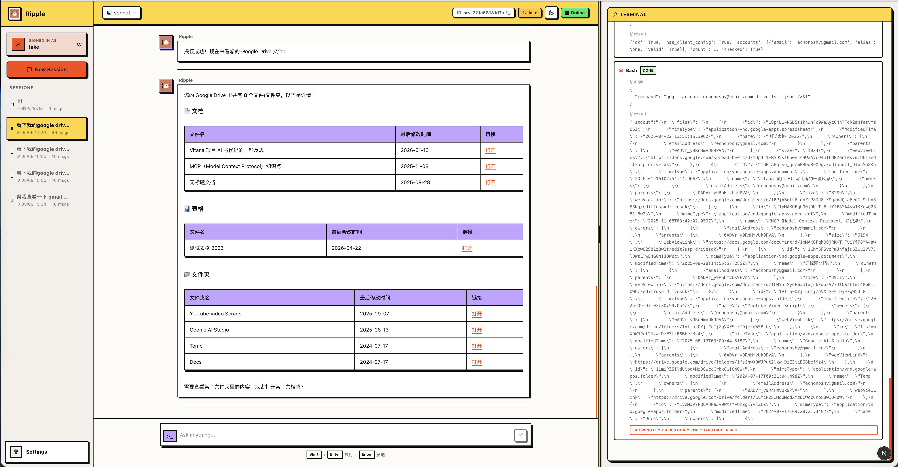

<div align="center">


# Ripple 涟漪

*让每个提问都成为涟漪的中心，每一次迭代都是向着解的蔓延。*

[](https://www.python.org/)
[](https://github.com/echonoshy/ripple)

**Ripple** 是一个面向多用户 sandbox 与 connector 调度的 Agent 控制面，默认把实际执行委托给服务端 Codex app-server。

⚠️ **注意：本项目目前处于快速开发（WIP）阶段，核心机制随时可能调整，功能尚不稳定。**

</div>

---

## 预览

<p align="center">
  
</p>

## 文档

- [Agent 系统架构说明](https://echonoshy.github.io/ripple/pages/agent-system-architecture.html)

## 功能概览

- 控制面：负责用户、session、sandbox、connector 授权、权限校验和任务生命周期。
- Codex 执行面：`/v1/chat/completions` 默认转接到当前 user sandbox 内的 Codex app-server。
- Runs API：`/v1/runs` 提供独立 Codex job 启动、状态、事件流、steer 和 cancel，适合 Web 长任务详情和外部调度器接入。
- 文件/文档：workspace 文件 API 是当前文件内容基座，documents API 提供轻量 metadata/index。
- Skill 系统：通过 Markdown + YAML frontmatter 定义可复用的任务模板。
- 内部用户配额：按 `user_id` 记录 workspace、session、run 等 quota；不包含 billing。
- user 级沙箱：按 `user_id` 隔离长期 workspace，一个 user 可拥有多个 session。
- Web 界面：基于 Vite + React 的交互式前端。

## 快速开始

### 环境要求

- Python 3.13+
- [uv](https://docs.astral.sh/uv/)
- [bun](https://bun.sh/)（仅运行 Web 前端时需要）
- nsjail（启用沙箱运行时需要）

### 1. 安装后端依赖

```bash
uv sync
```

### 2. 准备配置文件

项目不会提交真实密钥。先复制示例配置，再填入本地可用的 API key：

```bash
cp config/settings.yaml.sample config/settings.yaml
```

默认 Codex 主链至少需要配置：

- `external_agents.codex.codex_executable`：服务端可用的 Codex CLI。
- Codex CLI 登录态：用运行 Ripple 后端的同一个系统用户执行 `codex login` 或 `codex login --device-auth`。
- `server.api_keys`：访问 Ripple Server 的 API key。

`config/settings.yaml` 已被 `.gitignore` 忽略，请不要提交包含真实密钥的配置文件。

### 3. 启动后端服务

```bash
uv run ripple
```

开发时可启用自动重载：

```bash
uv run ripple --reload
```

默认服务地址为：

```text
http://localhost:8810
```

### 4. 启动 Web 前端

```bash
cd src/interfaces/web
bun install
bun run dev
```

默认前端地址为：

```text
http://localhost:8820
```

## 基础使用

### 多用户沙箱

Ripple Server 通过 HTTP Header 区分 user：

```http
X-Ripple-User-Id: <uid>
```

如果没有传入该 Header，会回落到 `default` user。`user_id` 只允许使用：

```text
[a-zA-Z0-9_-]{1,64}
```

同一个 user 的多个 session 共享同一个长期 workspace，并通过 user 级锁保证工具调用互斥。

### 沙箱管理端点

- `POST /v1/sandboxes`：为当前 user 幂等创建 sandbox。
- `GET /v1/sandboxes`：查看当前 user 的 sandbox 摘要。
- `DELETE /v1/sandboxes`：销毁当前 user 的 sandbox；`default` user 禁止销毁。

### 运行时目录

服务首次运行后会创建 `.ripple/`，该目录不应提交：

```text
.ripple/
├── logs/
├── sandboxes-cache/
└── sandboxes/
```

其中 `.ripple/sandboxes/<user_id>/workspace/` 是 user 级持久工作区，多个 session 会共享它。

## 项目结构

```text
src/
  ripple/              # Python 核心库
    core/              # 工具上下文与运行时基础类型
    agent_runners/     # Codex app-server 执行面
    connectors/        # 授权与外部账号连接
    documents/          # workspace 文档 metadata/index
    skills/            # Skill 系统
    messages/          # 消息类型
    permissions/       # 权限管理
    sandbox/           # nsjail 沙箱管理
    users/             # 内部用户 profile/quota
    tasks/             # 后台任务管理
  interfaces/
    server/            # FastAPI Server
    web/               # Vite + React 前端
tests/                 # 测试
scripts/               # 辅助脚本
config/                # 配置文件
skills/                # 共享 Skills
```

## Skill 系统

Skills 是带 YAML frontmatter 的 Markdown 文件，用于定义特定领域的任务模板。

加载层级：

1. Shared Skills：来自 `skills.shared_dirs` 配置，默认 `skills/*`。
2. Workspace Skills：来自每个 user workspace 内的 `skills/`。

详细说明见 [docs/SKILLS.md](docs/SKILLS.md)。

## 开发命令

### 后端

```bash
uv run pytest
uv run ruff format .
uv run ruff check .
```

### 前端

```bash
cd src/interfaces/web
bun run lint
bun run format:check
bun run build
```

## 配置说明

主配置文件为 `config/settings.yaml`，示例文件为 `config/settings.yaml.sample`。

配置包含：

- `api`：Codex 账号授权与 provider 元数据。
- `model`：默认 Codex 预设与模型别名。
- `agent`：兼容字段，主要保留 session 前缀等默认值。
- `logging`：日志级别、轮转和保留策略。
- `server`：HTTP 地址、访问密钥、Codex chat 和沙箱配置。
- `users`：内部用户 quota 默认值。
- `services`：第三方服务配置。
- `skills`：共享 Skill 目录。

## 注意事项

- 本项目仍处于 WIP 阶段，接口和配置可能变化。
- 不要提交 `config/settings.yaml`、`.ripple/` 或任何包含 token/API key 的文件。
- 如果需要测试或调试依赖网络的功能，请先确认本机网络代理配置可用。


<br/>

<div align="center">
<sub>Built with ❤️ by echonoshy</sub>
</div>
