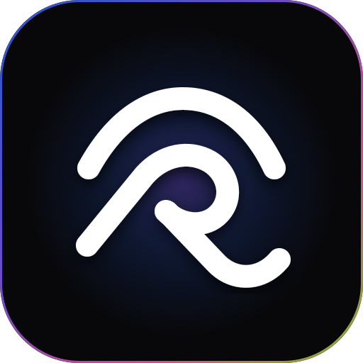

<div align="center">



# Ripple

运行在 Codex app-server 之上的多用户 Agent 控制面。

**状态：WIP。** Rust 后端是当前控制面实现；Python/FastAPI 后端和 legacy `src/ripple` 控制面已移除。Python 仅保留在部分 skill helper 中。


</div>

## 项目定位

Ripple 是 Codex app-server 的控制面，不是另一个模型执行器。

Ripple 负责管理多用户、session、run、workspace、sandbox、connector 授权、skill manifest、approval bridge、schedule、quota 和统一 `/v1` API。实际任务执行交给服务端预装并统一授权的 Codex app-server。

Web、Tauri desktop、iOS 和 Android 都是客户端，只调用 Ripple Server API，不承载后端业务逻辑。

## 当前主线

- Rust 后端：`crates/ripple-server`
- 主 App 客户端（Web / Tauri desktop / iOS / Android）：`app`
- 共享 skills：`skills`，其中部分 skill 自带 Python helper
- 产品介绍页：`sites/index.html`
- 运行时数据：`.ripple/`

## 已覆盖能力

- 配置加载、API key middleware、`X-Ripple-User-Id` 校验和 user quota。
- user sandbox、session metadata/messages、workspace file API、documents、users。
- Notion、Google Workspace、Feishu/Lark、Bilibili connector 授权、状态、账号和断开。
- Codex app-server JSON-RPC provider、per-user 执行锁、`/v1/runs`、`/v1/chat/completions`。
- OpenAI-compatible 非流式和 SSE 响应、Codex event 映射、token usage 持久化。
- Codex approval bridge、session stop/delete/context clear/suspend/resume。
- Schedule CRUD、run history、run-now、due schedule trigger、chat-side schedule proposal/confirmation。
- Codex managed permissions profile、服务端 Codex auth deny-read、skill manifest rendering。

## 架构边界

- Ripple Control Plane：API、鉴权、user/session/sandbox lifecycle、connector auth/status、skill manifest、approval bridge、job/event/output 状态。
- Codex Execution Plane：服务端 Codex app-server，由 Ripple 按 user 懒启动为可信服务端进程。
- Client Surface：`app` 里的 Web/Tauri/Mobile 客户端，只负责展示、交互和调用 `/v1`。

隔离单位是 `user_id`，不是 session。同一 user 的多个 session 共享长期 workspace。调用方通过 HTTP header `X-Ripple-User-Id: <uid>` 传入 user_id。

## 运行

1. 准备配置：

```bash
cp config/settings.yaml.sample config/settings.yaml
```

至少把 `server.api_keys` 改成本地 API key。需要真实 Codex 执行时，按示例配置里的 `external_agents.codex.codex_home` 登录服务端 Codex：

```bash
CODEX_HOME=.ripple/codex-service-home codex login
```

2. 启动 Rust 后端：

```bash
cargo run -p ripple-server
```

Rust 服务默认监听 `http://127.0.0.1:8810`（配置里是 `0.0.0.0:8810`），Web 开发代理默认转发 `/v1` 到这个端口。

3. 启动主 App 的 Web 开发模式：

```bash
cd app
bun install
bun run dev
```

Web dev server 默认监听 `http://localhost:8820`。

## 验证

Rust 后端：

```bash
cargo fmt -p ripple-server
cargo check -p ripple-server
cargo test -p ripple-server
bash scripts/smoke-rust-server.sh
```

前端：

```bash
cd app
bun run lint
bun run build
```

## 文档

- 开发依据：[AGENTS.md](AGENTS.md)
- 启动、打包和部署：[docs/BUILD_AND_DEPLOY.md](docs/BUILD_AND_DEPLOY.md)
- Rust 后端迁移：[docs/rust-backend-migration.md](docs/rust-backend-migration.md)
- Tauri mobile 打包：[docs/TAURI_MOBILE.md](docs/TAURI_MOBILE.md)
- Skills：[docs/SKILLS.md](docs/SKILLS.md)
