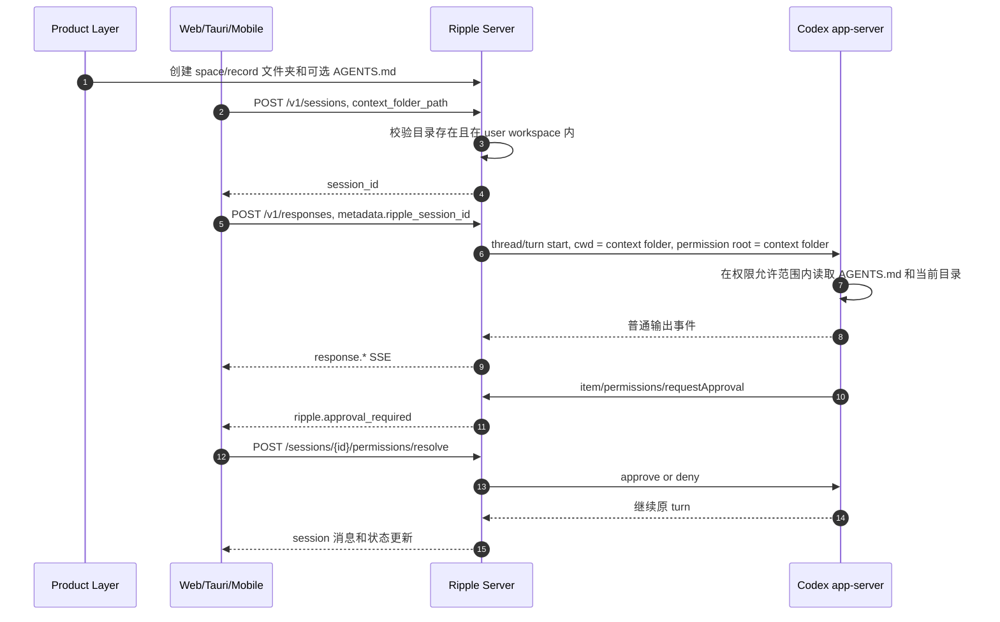
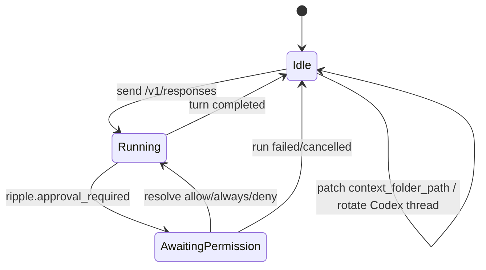

# Context Folder Permissions Integration

本文是 Ripple Server 目录级最小权限能力的对接文档，面向产品层、业务后端、Web/Tauri/Mobile 客户端。

核心目标：workspace / space / record 三层入口都能绑定到一个明确目录。Codex 默认只能在该目录内工作，跨目录读写必须走审批。

## 1. 一句话结论

- 产品层先创建真实目录，再创建或复用 Ripple session。
- session 的 `context_folder_path` 是本次对话的默认工作目录，也是 Codex permission root。
- `context_folder_path: null` 或 `"/workspace"` 表示整个 user workspace。
- space 对话传 `/workspace/spaces/<space_id>`。
- record 对话传 `/workspace/spaces/<space_id>/records/<record_id>`。
- 目录必须已经存在，并且必须在当前 user workspace 内。
- 当前目录默认可读写，同一 user workspace 下其他目录默认不可访问，需要 Codex 发起 `permissions` approval。
- `/v1/responses` 自动创建 session 时不能设置 `context_folder_path`。三层入口必须先 `POST /v1/sessions`，再用 `metadata.ripple_session_id` 续接。

## 2. 术语

| 名称 | 含义 |
| --- | --- |
| user workspace | 当前 `X-Ripple-User-Id` 对应的长期目录，对外显示为 `/workspace` |
| context folder | 本次 session 绑定的目录，由 `context_folder_path` 指定 |
| permission root | Codex 本次默认可操作的目录，等于 context folder |
| workspace 入口 | 直接在 `/workspace` 下对话，权限范围最大 |
| space 入口 | 在某个 space 目录下对话，例如 `/workspace/spaces/a` |
| record 入口 | 在某条记录目录下对话，例如 `/workspace/spaces/a/records/r1` |
| AGENTS.md | 给 Codex 看的目录规则文件，是上下文来源，不是安全边界 |
| permissions approval | Codex 申请临时访问其他目录时触发的审批 |

## 3. 职责边界

### 产品层负责

- 设计 workspace / space / record 的目录结构。
- 在创建 space / record 时创建对应目录。
- 按入口类型计算 `context_folder_path`。
- 创建 session 并保存 `session_id`。
- 给每一层目录写入合适的 `AGENTS.md`，如果该层需要规则。

### Ripple Server 负责

- 校验 `context_folder_path` 必须在当前 user workspace 内。
- 校验 `context_folder_path` 必须是已存在目录。
- 把 session 的 context folder 传给 Codex，作为 `cwd` 和 permission root。
- 生成 Codex managed permission profile。
- 接收 Codex `item/permissions/requestApproval`。
- 把审批请求暴露给客户端。
- 把客户端审批结果回传给 Codex。

### Codex app-server 负责

- 基于当前 `cwd` 和项目根读取可见的 `AGENTS.md`。
- 在需要越过 permission root 时发起权限申请。
- 根据用户选择继续或拒绝当前 turn。

### 客户端负责

- 调用 session / responses / resolve API。
- 监听 SSE 里的 `ripple.approval_required`。
- 渲染目录权限审批卡。
- 用户选择后调用 `/sessions/{session_id}/permissions/resolve`。
- resolve 后刷新 session 状态和消息。

## 4. 目录结构建议

推荐结构：

```text
/workspace/
├── AGENTS.md
├── spaces/
│   └── <space_id>/
│       ├── AGENTS.md
│       └── records/
│           └── <record_id>/
│               ├── AGENTS.md
│               ├── original.md
│               ├── summary.md
│               ├── title.md
│               └── mindmap.md
└── .tmp/
```

建议含义：

| 路径 | 用途 |
| --- | --- |
| `/workspace/AGENTS.md` | 当前 user workspace 的通用规则 |
| `/workspace/spaces/<space_id>/AGENTS.md` | 某个 space 的长期规则 |
| `/workspace/spaces/<space_id>/records/<record_id>/AGENTS.md` | 某条 record 的规则 |
| `original.md` | 原始记录 |
| `summary.md` | 摘要 |
| `title.md` | 标题 |
| `mindmap.md` | 脑图文本或结构化内容 |
| `/workspace/.tmp/` | runtime scratch 例外目录 |

`AGENTS.md` 不强制存在。没有就不会提供该层规则。

当前实现会允许 Codex 读取从 `/workspace` 到 context folder 路径上的 `AGENTS.md`。例如 record 入口是：

```text
/workspace/spaces/space_a/records/record_001
```

则以下文件如果存在，会被允许读取：

```text
/workspace/AGENTS.md
/workspace/spaces/AGENTS.md
/workspace/spaces/space_a/AGENTS.md
/workspace/spaces/space_a/records/AGENTS.md
/workspace/spaces/space_a/records/record_001/AGENTS.md
```

注意：AGENTS.md 是规则上下文，不是权限开关。真正的读写边界由 permission profile 和 Codex sandbox 执行。

## 5. 整体流程



## 6. 认证 Header

所有受保护接口统一带：

```http
Authorization: Bearer <server_api_key>
X-Ripple-User-Id: <user_id>
Content-Type: application/json
```

`X-Ripple-User-Id` 是 user workspace 隔离入口，合法字符为：

```text
[a-zA-Z0-9_-]{1,64}
```

生产环境应由可信上游注入，不应让浏览器自由伪造。

下面示例统一使用：

```bash
BASE_URL="http://127.0.0.1:8810/v1"
API_KEY="..."
USER_ID="u_123"
MODEL="codex-medium"
```

## 7. 初始化目录

`context_folder_path` 必须指向已存在目录。目录通常由产品层创建。

如果产品层只通过 Ripple workspace API 写文件，可以用 `PUT /v1/workspace/file` 创建父目录。写入文件时会自动创建父目录。

### 7.1 创建 space 目录和规则

```bash
curl -X PUT "$BASE_URL/workspace/file" \
  -H "Authorization: Bearer $API_KEY" \
  -H "X-Ripple-User-Id: $USER_ID" \
  -H "Content-Type: application/json" \
  -d '{
    "path": "/workspace/spaces/space_a/AGENTS.md",
    "content": "# Space Rules\n\n- 本目录保存一个 space 下的长期上下文。\n- 默认只处理本 space 里的内容。\n"
  }'
```

### 7.2 创建 record 目录和规则

```bash
curl -X PUT "$BASE_URL/workspace/file" \
  -H "Authorization: Bearer $API_KEY" \
  -H "X-Ripple-User-Id: $USER_ID" \
  -H "Content-Type: application/json" \
  -d '{
    "path": "/workspace/spaces/space_a/records/record_001/AGENTS.md",
    "content": "# Record Rules\n\n- 本目录保存单条记录的原文、摘要、标题和脑图。\n- 优先在本目录内创建和更新结果文件。\n"
  }'
```

### 7.3 写入原始记录

```bash
curl -X PUT "$BASE_URL/workspace/file" \
  -H "Authorization: Bearer $API_KEY" \
  -H "X-Ripple-User-Id: $USER_ID" \
  -H "Content-Type: application/json" \
  -d '{
    "path": "/workspace/spaces/space_a/records/record_001/original.md",
    "content": "这里是原始记录内容。"
  }'
```

只要目录存在即可，不要求一定写 `AGENTS.md`。如果没有规则，可以写 `.keep` 或业务文件来创建目录。

## 8. 创建 Session

### 8.1 Workspace 入口

适合需要在整个 workspace 内整理、搜索、重构的对话。

```bash
curl -X POST "$BASE_URL/sessions" \
  -H "Authorization: Bearer $API_KEY" \
  -H "X-Ripple-User-Id: $USER_ID" \
  -H "Content-Type: application/json" \
  -d '{
    "model": "'"$MODEL"'",
    "context_folder_path": null
  }'
```

也可以传：

```json
{
  "context_folder_path": "/workspace"
}
```

服务端会规范化为 `null`，含义仍是整个 workspace。

### 8.2 Space 入口

适合围绕某个 space 的多条记录做分析。

```bash
curl -X POST "$BASE_URL/sessions" \
  -H "Authorization: Bearer $API_KEY" \
  -H "X-Ripple-User-Id: $USER_ID" \
  -H "Content-Type: application/json" \
  -d '{
    "model": "'"$MODEL"'",
    "context_folder_path": "/workspace/spaces/space_a"
  }'
```

### 8.3 Record 入口

适合围绕单条记录生成摘要、标题、脑图、结构化字段。

```bash
curl -X POST "$BASE_URL/sessions" \
  -H "Authorization: Bearer $API_KEY" \
  -H "X-Ripple-User-Id: $USER_ID" \
  -H "Content-Type: application/json" \
  -d '{
    "model": "'"$MODEL"'",
    "context_folder_path": "/workspace/spaces/space_a/records/record_001"
  }'
```

响应示例：

```json
{
  "session_id": "srv-abc123def456",
  "title": "",
  "pinned": false,
  "status": "idle",
  "model": "codex-medium",
  "created_at": "2026-07-09T12:00:00Z",
  "last_active": "2026-07-09T12:00:00Z",
  "message_count": 0,
  "changed_file_count": 0,
  "pending_approval_count": 0,
  "context_folder_path": "/workspace/spaces/space_a/records/record_001"
}
```

客户端需要保存：

| 字段 | 用途 |
| --- | --- |
| `session_id` | 后续 `/v1/responses` 续接 |
| `context_folder_path` | UI 展示当前对话绑定目录 |
| `status` | 判断是否可以发送新消息或切换目录 |
| `pending_approval_count` | 列表页展示待处理状态 |

前端 TypeScript 字段是 camelCase：

```ts
await createSession({
  model: "codex-medium",
  contextFolderPath: "/workspace/spaces/space_a/records/record_001",
});
```

HTTP JSON 字段是 snake_case：

```json
{
  "context_folder_path": "/workspace/spaces/space_a/records/record_001"
}
```

## 9. 发送 Chat

推荐使用 `/v1/responses`，并显式传入 session id。

```bash
SESSION_ID="srv-abc123def456"

curl -N -X POST "$BASE_URL/responses" \
  -H "Authorization: Bearer $API_KEY" \
  -H "X-Ripple-User-Id: $USER_ID" \
  -H "Content-Type: application/json" \
  -d '{
    "model": "'"$MODEL"'",
    "stream": true,
    "previous_response_id": "resp_'"$SESSION_ID"'",
    "metadata": {
      "ripple_session_id": "'"$SESSION_ID"'",
      "req_id": "client-request-001"
    },
    "input": [
      {
        "role": "user",
        "content": "请基于这条记录生成 summary.md 和 title.md。"
      }
    ]
  }'
```

规则：

- `metadata.ripple_session_id` 是最明确的续接方式。
- `previous_response_id` 可以传 `resp_<session_id>`，兼容 Responses-style 客户端。
- 两者都传时必须指向同一个 session。
- 不要在 `/v1/responses` body 里临时传目录。目录绑定在 session 上。
- 如果直接调用 `/v1/responses` 且没有任何 session id，后端可以自动创建 session，但这个自动 session 无法设置 `context_folder_path`，因此只适合 workspace 根入口或兼容旧客户端。

## 10. 权限行为

### 10.1 Workspace 入口

```json
{
  "context_folder_path": null
}
```

效果：

- Codex cwd 是 `/workspace`。
- 整个 `/workspace` 默认可写。
- workspace 内部一般不会触发跨目录审批。
- 仍然会保护 Codex auth、其他 user sandbox、native skill bypass 路径等服务端敏感位置。

### 10.2 Space 入口

```json
{
  "context_folder_path": "/workspace/spaces/space_a"
}
```

效果：

- Codex cwd 是 `/workspace/spaces/space_a`。
- 默认只能读写 `space_a`。
- 访问 `/workspace/spaces/space_b` 需要审批。
- 访问 `/workspace/global.md` 需要审批。

### 10.3 Record 入口

```json
{
  "context_folder_path": "/workspace/spaces/space_a/records/record_001"
}
```

效果：

- Codex cwd 是 `/workspace/spaces/space_a/records/record_001`。
- 默认只能读写 `record_001`。
- 访问同一 space 下的 `record_002` 需要审批。
- 访问上级 `space_a` 的普通文件需要审批。
- 从 `/workspace` 到 `record_001` 的 AGENTS.md 可读。

### 10.4 固定例外

以下不是业务目录授权，而是运行时必要例外：

| 路径类型 | 权限 | 原因 |
| --- | --- | --- |
| 当前 context folder | write | 本次任务默认工作区 |
| `/workspace/.tmp` | write | 运行时 scratch |
| ancestor `AGENTS.md` | read | 加载目录规则 |
| shared skills | read | Ripple skill manifest 指向的共享 skill |
| CLI/runtime/cache 必要路径 | read/write | Codex 和 connector 运行所需 |
| Codex auth / credentials | deny | 防止泄露服务端授权 |
| 其他 user sandbox | deny | user 隔离 |
| `.agents/skills` / `.codex/skills` | deny | 避免绕过 Ripple skill manifest |

## 11. SSE 事件处理

普通模型文本走 Responses-style 事件：

```text
event: response.output_text.delta
data: {"type":"response.output_text.delta","delta":"..."}
```

Ripple 控制面事件走 `ripple.*` 事件名，并带 `ripple_event_type`：

```text
event: ripple.approval_required
data: {
  "type": "ripple.approval_required",
  "ripple_event_type": "approval_required",
  "approval": {
    "job_id": "agent-xxxx",
    "session_id": "srv-abc123def456",
    "request_id": "req-xxx",
    "action": "permissions",
    "metadata": {
      "reason": "Need to read a sibling record",
      "cwd": "/workspace/spaces/space_a/records/record_001",
      "permissions": {
        "file_system": {
          "entries": [
            {
              "path": "/workspace/spaces/space_a/records/record_002",
              "mode": "read"
            }
          ]
        }
      }
    }
  }
}
```

客户端处理建议：

- 如果 SSE `type` 以 `ripple.` 开头，优先用 `ripple_event_type` 判断业务事件。
- `ripple_event_type === "approval_required"` 时读取 `approval`。
- `approval.action === "permissions"` 时展示目录权限审批卡。
- 审批卡至少展示 `metadata.reason`、`metadata.cwd`、read paths、write paths。
- 其他 approval 类型继续保留 JSON fallback，不要丢失原始信息。

## 12. 权限审批 UI

### 12.1 展示字段

建议 UI 文案：

| 字段 | 展示 |
| --- | --- |
| `metadata.reason` | Codex 为什么需要权限 |
| `metadata.cwd` | 当前工作目录 |
| read paths | 申请读取的目录或文件 |
| write paths | 申请写入的目录或文件 |

按钮：

| UI 操作 | API action | Codex scope | 含义 |
| --- | --- | --- | --- |
| 允许一次 | `allow` | `turn` | 只允许当前 turn |
| 本会话允许 | `always` | `session` | 当前 Codex session 后续也允许 |
| 拒绝 | `deny` | 空 permissions | 不授予任何权限 |

第一版没有跨 session 永久授权。`always` 只表示当前 Codex session。

### 12.2 调用 resolve

```bash
curl -X POST "$BASE_URL/sessions/$SESSION_ID/permissions/resolve" \
  -H "Authorization: Bearer $API_KEY" \
  -H "X-Ripple-User-Id: $USER_ID" \
  -H "Content-Type: application/json" \
  -d '{
    "action": "allow"
  }'
```

响应：

```json
{
  "ok": true,
  "session_id": "srv-abc123def456",
  "job_id": "agent-xxxx",
  "action": "allow"
}
```

前端 TypeScript：

```ts
await resolveSessionPermissionRequest(sessionId, "allow");
await resolveSessionPermissionRequest(sessionId, "always");
await resolveSessionPermissionRequest(sessionId, "deny");
```

### 12.3 resolve 后不要重发用户消息

触发审批时，原 Codex turn 是暂停状态。调用 resolve 后，后端会把审批结果交回原 turn，并在后台继续运行。

客户端不要重新发送原用户输入，否则会造成重复 turn。

推荐恢复流程：

1. 调用 `/sessions/{session_id}/permissions/resolve`。
2. 立即刷新 `GET /v1/sessions/{session_id}`。
3. 如果 `status` 是 `running`，继续轮询。
4. 如果 `status` 是 `awaiting_permission` 且仍有 `pending_permission_request`，继续展示新审批卡。
5. 如果 `status` 回到 `idle` 或完成状态，刷新消息列表。

## 13. 获取 Session 详情

```bash
curl "$BASE_URL/sessions/$SESSION_ID" \
  -H "Authorization: Bearer $API_KEY" \
  -H "X-Ripple-User-Id: $USER_ID"
```

重点字段：

```json
{
  "session_id": "srv-abc123def456",
  "status": "awaiting_permission",
  "context_folder_path": "/workspace/spaces/space_a/records/record_001",
  "pending_permission_request": {
    "action": "permissions",
    "metadata": {}
  },
  "messages": []
}
```

不同接口的详情包装可能略有差异，客户端现有 API 层已经做了 normalize。对接时重点看：

- `status`
- `context_folder_path`
- `pending_permission_request`
- `messages`
- `pending_approval_count`

## 14. 更新 Context Folder

切换到另一个 space：

```bash
curl -X PATCH "$BASE_URL/sessions/$SESSION_ID" \
  -H "Authorization: Bearer $API_KEY" \
  -H "X-Ripple-User-Id: $USER_ID" \
  -H "Content-Type: application/json" \
  -d '{
    "context_folder_path": "/workspace/spaces/space_b"
  }'
```

重置为 workspace 根：

```bash
curl -X PATCH "$BASE_URL/sessions/$SESSION_ID" \
  -H "Authorization: Bearer $API_KEY" \
  -H "X-Ripple-User-Id: $USER_ID" \
  -H "Content-Type: application/json" \
  -d '{
    "context_folder_path": null
  }'
```

限制：

- 目标目录必须存在。
- session 正在 running、awaiting permission、awaiting user input、compacting，或存在 active run 时，返回 `409`。
- 更新只影响后续 turn。
- 已经在跑的 turn 不会中途换 cwd 或权限根。
- 规范化后的路径实际变化时，Ripple 会保留 session 消息并轮换底层 Codex thread；下一轮在新 cwd 和 permission root 下创建 thread。重复 PATCH 同一路径或只更新其他 metadata 不会轮换 thread。

前端 TypeScript：

```ts
await updateSession(sessionId, {
  contextFolderPath: "/workspace/spaces/space_b",
});

await updateSession(sessionId, {
  contextFolderPath: null,
});
```

## 15. 独立 Run API

如果外部调度器直接走 `/v1/runs`，`cwd` 同样是该 run 的 permission root。

```bash
curl -X POST "$BASE_URL/runs" \
  -H "Authorization: Bearer $API_KEY" \
  -H "X-Ripple-User-Id: $USER_ID" \
  -H "Content-Type: application/json" \
  -d '{
    "provider": "codex",
    "prompt": "检查这条记录并补齐 summary.md",
    "cwd": "/workspace/spaces/space_a/records/record_001"
  }'
```

规则：

- `cwd` 未传时默认为 `/workspace`。
- `cwd` 传 `/workspace/...` 时必须在当前 user workspace 内。
- run 是一次性任务，不等同于 chat session 的多轮上下文。
- 如果产品上是三层对话入口，优先用 session + `/v1/responses`。

## 16. 错误码与处理

| 状态码 | 场景 | 处理 |
| --- | --- | --- |
| `400` | `context_folder_path` 非法、越界、不是目录，或请求缺少 user message | 修正路径或请求体 |
| `401` | API key 或 user auth 无效 | 重新认证 |
| `404` | session、run 或 workspace 文件不存在 | 刷新状态或重新创建 |
| `409` | session 正在运行、正在等待审批、正在 compact，或没有待处理审批 | 刷新 session 状态后重试 |
| `428` | 高风险 workspace/connector API 缺少 `confirm: true` | 让用户确认后重试 |

常见错误：

| 错误 | 原因 | 修复 |
| --- | --- | --- |
| 创建 session 返回 `Context folder path must be an existing directory` | 目录不存在，或目标是文件 | 先创建目录或写入该目录下文件 |
| 创建 session 返回越界路径错误 | 路径不是 `/workspace/...`，或试图访问其他 user 目录 | 只传当前 user workspace 内路径 |
| 切换 context folder 返回 `409` | 当前 session 还有运行中任务或待审批 | 等任务结束，或先处理审批 |
| 审批后没有继续输出 | 原 SSE 已结束，后端在后台继续运行 | 轮询 session 详情 |
| 跨目录没有弹审批 | 当前 context 是 `/workspace`，或访问路径仍在 permission root 内 | 检查 session 的 `context_folder_path` |

## 17. 接入状态机

客户端可以按下面状态处理：



简化逻辑：

```ts
if (session.pendingPermissionRequest) {
  renderPermissionCard(session.pendingPermissionRequest);
} else if (session.status === "running") {
  renderRunningState();
} else {
  renderInputBox();
}
```

## 18. 前端接入清单

1. 根据入口类型计算 `context_folder_path`。
2. 确保该目录存在，必要时写入 `AGENTS.md` 或 `.keep` 初始化目录。
3. `POST /v1/sessions` 创建 session，并保存 `session_id`。
4. 发送消息时调用 `POST /v1/responses`，带 `metadata.ripple_session_id`。
5. SSE 中处理 `ripple.approval_required`。
6. 对 `approval.action === "permissions"` 渲染结构化权限卡。
7. 用户选择后调用 `/sessions/{id}/permissions/resolve`。
8. resolve 后不要重发消息，轮询 session 详情。
9. 切换 space/record 前，确认 session 没有 running、awaiting permission、compacting。
10. session 列表页使用 `pending_approval_count` 或 `pending_permission_request` 展示待处理状态。

## 19. 后端/产品层接入清单

1. 为每个 user 维护自己的 `space_id` 和 `record_id`。
2. 创建 space 时落盘 `/workspace/spaces/<space_id>/`。
3. 创建 record 时落盘 `/workspace/spaces/<space_id>/records/<record_id>/`。
4. 把原始记录、摘要、标题、脑图等文件放在 record 目录内。
5. 不要让不同 user 共享同一个 workspace 路径。
6. 业务数据库里保存 `session_id` 和业务对象的绑定关系。
7. 需要复用历史对话时，复用原 `session_id`。
8. 需要新上下文边界时，新建 session，不要在运行中强行切换目录。

## 20. 不要这样接

- 不要把目录路径只写进 prompt，必须绑定到 `context_folder_path`。
- 不要依赖模型“自觉”不访问其他目录，安全边界是 permission profile。
- 不要用 `/v1/responses` 自动创建三层 session，它无法设置 `context_folder_path`。
- 不要在等待审批或运行中切换 context folder。
- 不要把跨 session 永久授权存在客户端，第一版没有永久授权。
- 不要把服务端 Codex auth、connector credentials、API key 写进 `/workspace`。
- 不要把所有 record 都放在一个平铺目录里再靠 prompt 区分，这会削弱权限边界。

## 21. 最小可跑通脚本

下面脚本演示 record 入口的完整链路。

```bash
BASE_URL="http://127.0.0.1:8810/v1"
API_KEY="..."
USER_ID="u_123"
MODEL="codex-medium"
SPACE_ID="space_a"
RECORD_ID="record_001"
RECORD_DIR="/workspace/spaces/$SPACE_ID/records/$RECORD_ID"

curl -X PUT "$BASE_URL/workspace/file" \
  -H "Authorization: Bearer $API_KEY" \
  -H "X-Ripple-User-Id: $USER_ID" \
  -H "Content-Type: application/json" \
  -d '{
    "path": "'"$RECORD_DIR"'/AGENTS.md",
    "content": "# Record Rules\n\n- 输出文件写在当前记录目录。\n"
  }'

curl -X PUT "$BASE_URL/workspace/file" \
  -H "Authorization: Bearer $API_KEY" \
  -H "X-Ripple-User-Id: $USER_ID" \
  -H "Content-Type: application/json" \
  -d '{
    "path": "'"$RECORD_DIR"'/original.md",
    "content": "这里是一条需要总结的记录。"
  }'

SESSION_JSON=$(curl -sS -X POST "$BASE_URL/sessions" \
  -H "Authorization: Bearer $API_KEY" \
  -H "X-Ripple-User-Id: $USER_ID" \
  -H "Content-Type: application/json" \
  -d '{
    "model": "'"$MODEL"'",
    "context_folder_path": "'"$RECORD_DIR"'"
  }')

echo "$SESSION_JSON"
SESSION_ID=$(printf "%s" "$SESSION_JSON" | sed -n 's/.*"session_id":"\([^"]*\)".*/\1/p')

curl -N -X POST "$BASE_URL/responses" \
  -H "Authorization: Bearer $API_KEY" \
  -H "X-Ripple-User-Id: $USER_ID" \
  -H "Content-Type: application/json" \
  -d '{
    "model": "'"$MODEL"'",
    "stream": true,
    "previous_response_id": "resp_'"$SESSION_ID"'",
    "metadata": {
      "ripple_session_id": "'"$SESSION_ID"'",
      "req_id": "record-demo-001"
    },
    "input": [
      {
        "role": "user",
        "content": "读取 original.md，生成 summary.md 和 title.md。"
      }
    ]
  }'
```

如果环境里有 `jq`，建议用 `jq -r .session_id` 取 session id。上面用 `sed` 只是为了最少依赖。

## 22. 验收标准

完成对接后，至少验证这些场景：

| 场景 | 预期 |
| --- | --- |
| record session 写 `summary.md` | 文件写在当前 record 目录 |
| record session 读同级 record | 触发 `permissions` approval |
| 用户点允许一次 | 当前 turn 继续，后续 turn 仍需再次申请 |
| 用户点本会话允许 | 当前 Codex session 后续可继续访问该授权路径 |
| 用户点拒绝 | Codex 收到空 permissions，不能访问目标路径 |
| space session 访问本 space 文件 | 默认允许 |
| space session 访问其他 space | 触发审批 |
| workspace session 访问任意 workspace 文件 | 默认允许 |
| 创建 session 传不存在目录 | 返回 `400` |
| 运行中切换 context folder | 返回 `409` |
